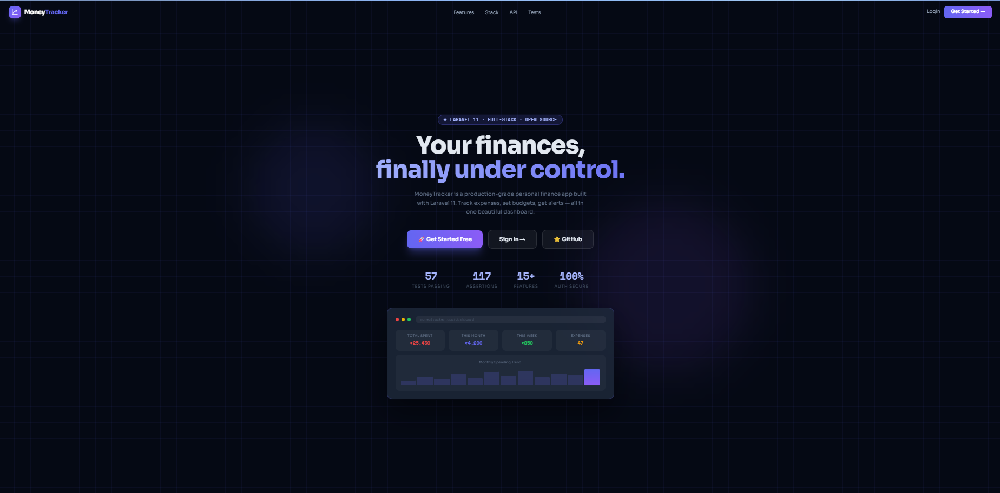
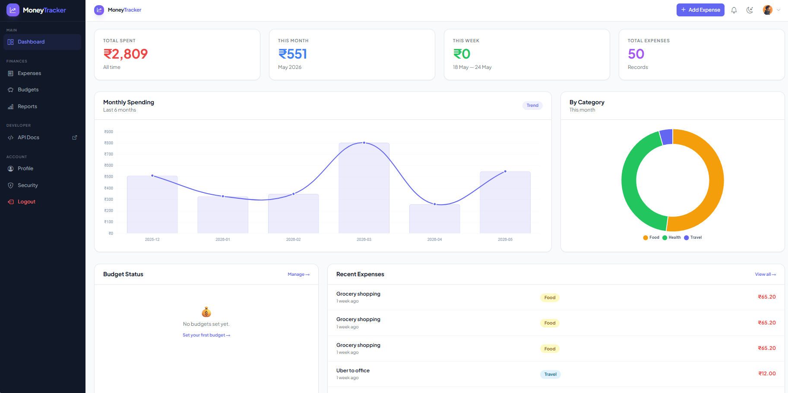
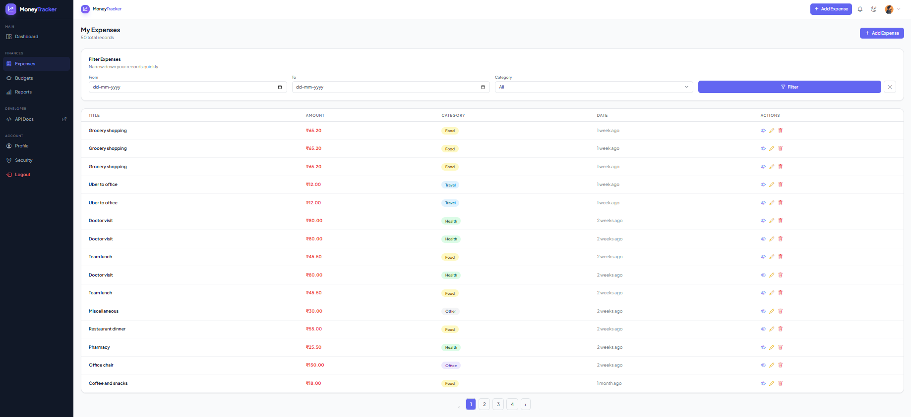
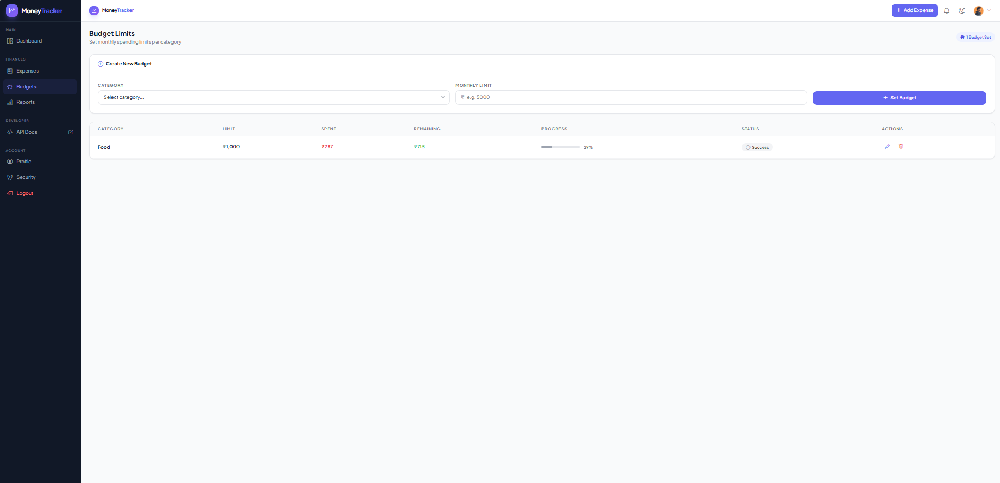
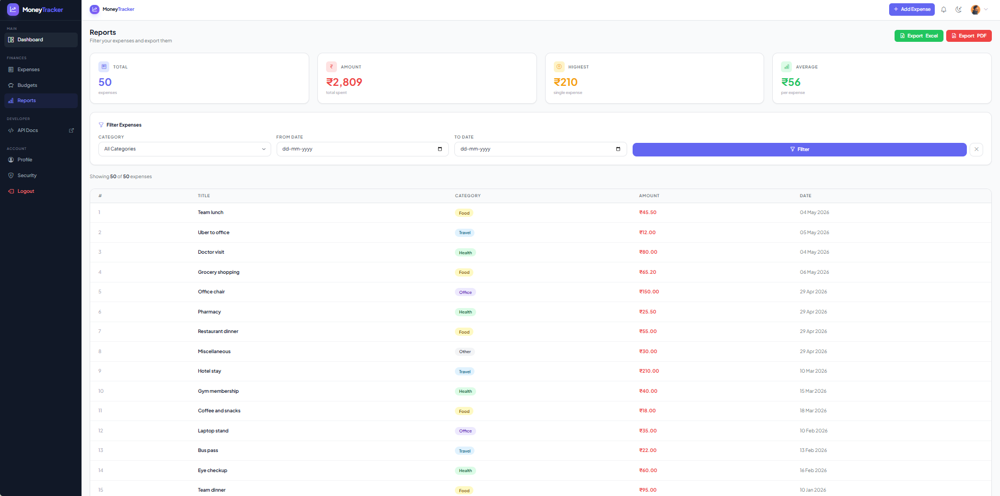
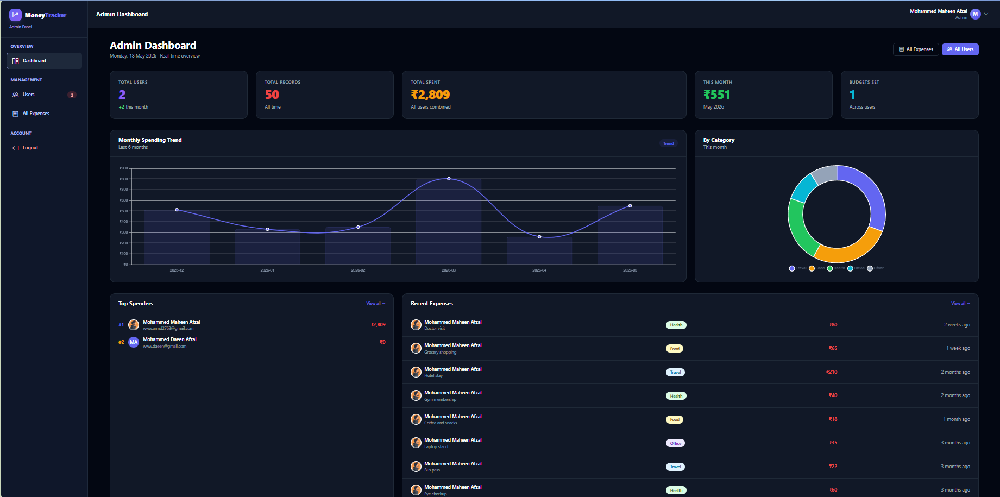
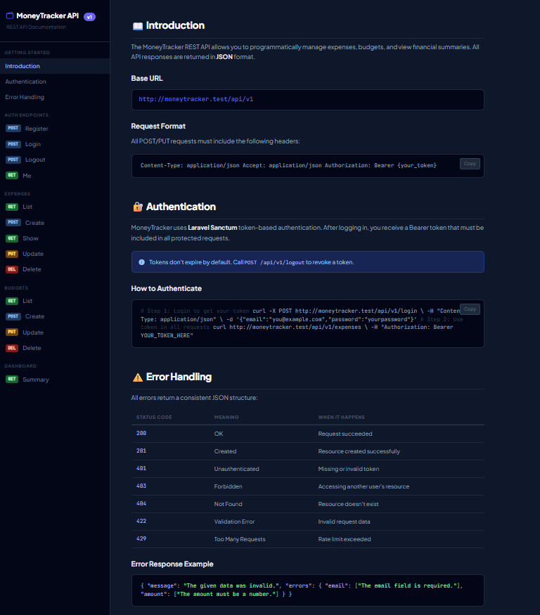

# 💰 MoneyTracker

> A production-grade personal finance management application built with Laravel 11.


---

## 📸 Screenshots

### 🏠 Landing Page



### 📊 Dashboard



### 💸 Expenses



### 🏷️ Budgets



### 📈 Reports



### 🛡️ Admin Panel



### 🌐 API Docs



### 🌙 Dark Mode

## 

## ✨ Features

### 💸 Expense Management

- Full CRUD with soft delete
- Categories: Food, Travel, Health, Office, Other
- Receipt file uploads (JPG, PNG, PDF)
- Advanced filtering by date and category

### 🏷️ Budget Limits

- Set monthly spending limits per category
- Visual progress bars with color indicators
- Real-time alerts when limits are approached or exceeded

### 🔔 Smart Notifications

- In-app bell notifications with unread count
- Email alerts for budget exceeded events
- Welcome email on registration
- Expense receipt emails
- Weekly spending summary reports

### 📊 Reports & Export

- Filter expenses by date range and category
- Summary stats (total, highest, average)
- Export to **PDF** and **Excel**

### 🔒 Security

- Laravel Breeze authentication
- Two-Factor Authentication (Google Authenticator / TOTP)
- Policy-based authorization
- Laravel Sanctum API tokens

### 🛡️ Admin Panel

- Separate admin guard
- User management (view, ban, delete)
- All expenses overview with filters
- Platform-wide statistics and charts

### 🌐 REST API

- Sanctum token authentication
- Full CRUD for expenses and budgets
- Dashboard summary endpoint
- Interactive API documentation at `/api/docs`

### 🧪 Testing

- **57 tests** · **117 assertions**
- PestPHP test suite
- Feature and unit tests

---

## 🛠️ Tech Stack

| Layer     | Technology                                |
| --------- | ----------------------------------------- |
| Backend   | Laravel 11, PHP 8.2                       |
| Database  | MySQL 8.0                                 |
| Frontend  | Tailwind CSS, Bootstrap Icons, Vanilla JS |
| Charts    | Chart.js                                  |
| Auth      | Laravel Breeze, Sanctum, TOTP (2FA)       |
| Email     | Custom Blade templates, Queue, Mailtrap   |
| Export    | DomPDF (PDF), Laravel Excel (XLSX)        |
| Testing   | PestPHP                                   |
| Dev Tools | Laravel Herd, Vite                        |

---

## 🚀 Getting Started

### Prerequisites

- PHP 8.2+
- Composer
- MySQL 8.0+
- Node.js 18+
- Laravel Herd or XAMPP (local dev)

### Installation

**1 — Clone the repository:**

```bash
git clone https://github.com/maheen-2763/moneytracker.git
cd moneytracker
```

**2 — Install dependencies:**

```bash
composer install
npm install
```

**3 — Set up environment:**

```bash
cp .env.example .env
php artisan key:generate
```

**4 — Configure `.env`:**

```env
DB_CONNECTION=mysql
DB_HOST=127.0.0.1
DB_PORT=3306
DB_DATABASE=moneytracker
DB_USERNAME=root
DB_PASSWORD=

MAIL_MAILER=smtp
MAIL_HOST=sandbox.smtp.mailtrap.io
MAIL_PORT=2525
MAIL_USERNAME=your_mailtrap_username
MAIL_PASSWORD=your_mailtrap_password

QUEUE_CONNECTION=database
```

**5 — Run migrations and seeders:**

```bash
php artisan migrate --seed
```

**6 — Build assets:**

```bash
npm run dev
```

**7 — Start the server:**

```bash
php artisan serve
```

**8 — Run queue worker (for emails):**

```bash
php artisan queue:work
```

Visit `http://127.0.0.1:8000` 🎉

---

## 👤 Default Credentials

**Admin Panel** (`/admin/login`):

```
Email:    admin@moneytracker.com
Password: admin123
```

**Test User** (after seeding):

```
Email:    user@moneytracker.com
Password: password
```

---

## 🧪 Running Tests

```bash
php artisan test
```

Or with coverage:

```bash
php artisan test --coverage
```

Expected output:

```
Tests:    57 passed
Assertions: 117
Duration: ~5.68s
```

---

## 📧 Email Notifications

| Email           | Trigger                       |
| --------------- | ----------------------------- |
| Welcome         | On registration               |
| Expense Receipt | After adding an expense       |
| Budget Exceeded | When monthly limit is crossed |
| Weekly Summary  | Every Monday via scheduler    |
| Password Reset  | On forgot password request    |

**Run the scheduler locally:**

```bash
php artisan schedule:run
```

**Or run weekly report manually:**

```bash
php artisan reports:weekly
```

---

## 🌐 API Documentation

Interactive API docs are available at:

```
http://127.0.0.1:8000/api/docs
```

**Quick Start:**

```bash
# Login to get token
curl -X POST http://127.0.0.1:8000/api/v1/login \
  -H "Content-Type: application/json" \
  -d '{"email":"user@example.com","password":"password"}'

# Use token in requests
curl http://127.0.0.1:8000/api/v1/expenses \
  -H "Authorization: Bearer YOUR_TOKEN"
```

**Available Endpoints:**

| Method | Endpoint                | Description       |
| ------ | ----------------------- | ----------------- |
| POST   | `/api/v1/register`      | Create account    |
| POST   | `/api/v1/login`         | Get auth token    |
| POST   | `/api/v1/logout`        | Revoke token      |
| GET    | `/api/v1/me`            | Current user      |
| GET    | `/api/v1/expenses`      | List expenses     |
| POST   | `/api/v1/expenses`      | Create expense    |
| GET    | `/api/v1/expenses/{id}` | Show expense      |
| PUT    | `/api/v1/expenses/{id}` | Update expense    |
| DELETE | `/api/v1/expenses/{id}` | Delete expense    |
| GET    | `/api/v1/budgets`       | List budgets      |
| POST   | `/api/v1/budgets`       | Create budget     |
| PUT    | `/api/v1/budgets/{id}`  | Update budget     |
| DELETE | `/api/v1/budgets/{id}`  | Delete budget     |
| GET    | `/api/v1/dashboard`     | Dashboard summary |

---

## 📁 Project Structure

```
app/
├── Console/Commands/      # SendWeeklyReports scheduler
├── Http/
│   ├── Controllers/       # All controllers
│   ├── Middleware/        # RequiresTwoFactor, etc.
│   └── Requests/          # Form request validation
├── Mail/                  # Mailable classes
├── Models/                # Eloquent models
├── Notifications/         # BudgetExceeded notification
├── Policies/              # Authorization policies
└── Services/              # ExpenseService (service layer)

resources/views/
├── admin/                 # Admin panel views
├── auth/                  # Auth pages
├── budgets/               # Budget views
├── components/            # Reusable components
├── emails/                # Email templates
├── expenses/              # Expense views
├── notifications/         # Notification views
├── profile/               # Profile & security
└── reports/               # Reports & export
```

---

## 🔐 Security Features

- ✅ CSRF protection on all forms
- ✅ Policy-based authorization (users can only access own data)
- ✅ Two-Factor Authentication (TOTP)
- ✅ Sanctum API token authentication
- ✅ Password hashing with bcrypt
- ✅ Separate admin guard
- ✅ Rate limiting on API routes

---

## 📄 License

This project is open source and available under the [MIT License](LICENSE).

---

## 👨‍💻 Developer

**Mohammed Maheen Afzal**
Junior Full-Stack Laravel Developer

- 🐙 GitHub: [@maheen-2763](https://github.com/maheen-2763)
- 📦 Repo: [moneytracker](https://github.com/maheen-2763/moneytracker)

---

<div align="center">
Built with ❤️ using Laravel 11 · MoneyTracker v1.0.0
</div>
